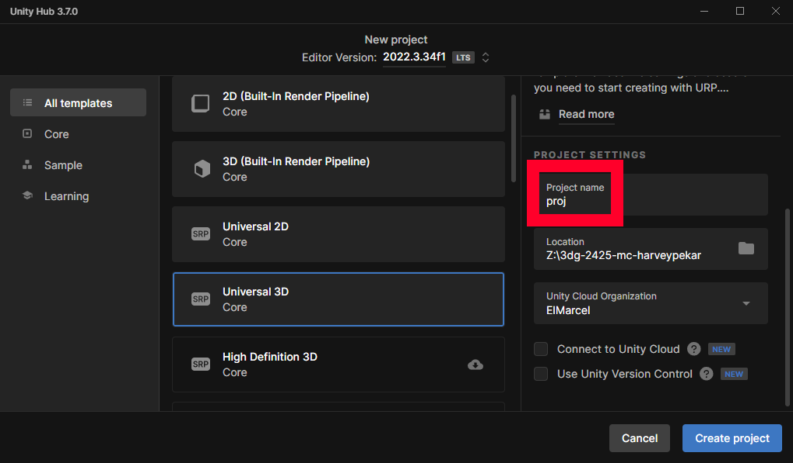
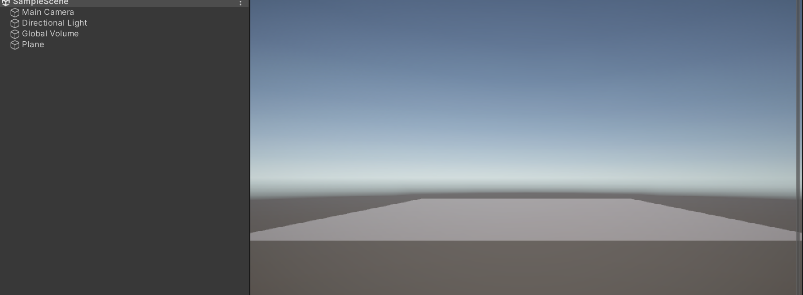
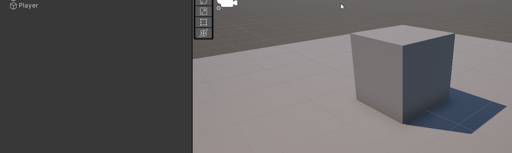
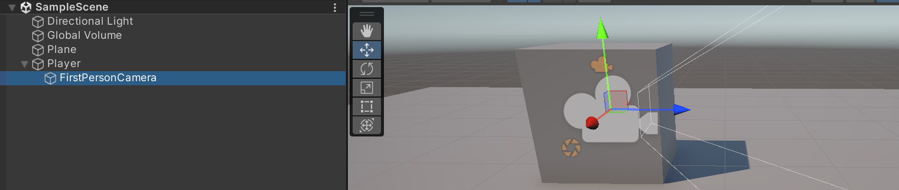
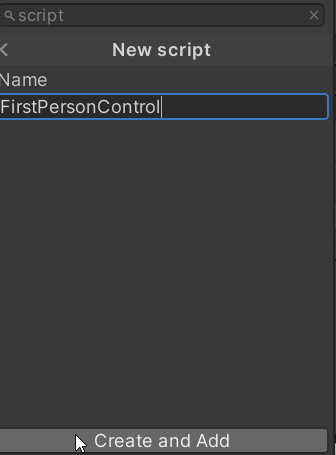
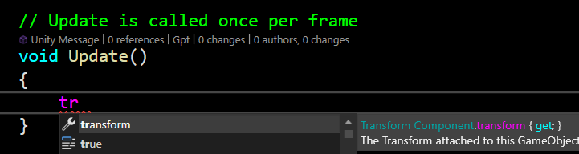
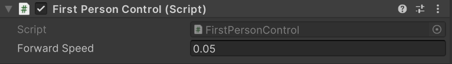

This document is incomplete. It will be communicated on Toledo when it is complete, en this message won't be present at the top

# 3D Graphics project

This is the assignment for the course '3d graphics'. This assignment will be graded both as code (I check your results at home), as well as an oral exam defending your code. This document describes what you need to implement. I recommend you don't start coding from the start, I would recommend you scan this entire document, especially the hints section, before you start.

## Requirements

* You implemented features described in this document (you will not get any points for implementing something that isn't described here)
* You understand all the code that you submit, even if you have it from an AI model or a tutorial
* You are not allowed to share code with others taking (or who have taken) this course
* You are not allowed to use packages outside of the core Unity ones, without explicit approval (send me an email, and add a motivation)
* Feel free to add extra features (eg debug camera, debug visualizations, debug logging), but if they interfere with your result (how things look / act), have a way to turn them on/off and have them default off.
* Your code is tidy. By this I mean that you shouldn't have large swathes of duplicated code, bad indentation, or badly named variables. Do not worry too much about using patterns (assume your code won't be extended in the future) or complicated oo techniques, this is not the objectives of this course.

## First steps

* Accept the assignment on [Github Classroom](https://classroom.github.com/a/uiOfXHY_)
* Submit the link to the repo on your github that you got from accepting the assignment on Github
* Create a new Universal 3D (or in older editors, URP) project in your repository. !!! make sure to name it 'proj' !!! (the reason of this is that the .gitignore file a)

 
 

## Movement and Camera placement

Start by adding a plane object. We'll use this as 'fake' terrain before we implement our own. 

 

 We'll also add a representation of the player. Add a cube and move it so it's sits exactly on the plane. Rename it in the hierarchy windows to be called 'Player'.

 

## 1st person camera

### Hierarchy

Let's start implementing our camera. To be honest, it's more than a camera, as we're going to move the player. The camera will follow automatically.

That last part is really easy to implement: move the existing camera in the hierarchy view and make it a child of the our Player (cube). Then, move it to be at the exact center of our cube. 

 

Try rotating and translating (moving) our cube. You'll see that the camera (hopefully) follows along. If it works, commit & push.

### Moving forward

Now we can start in earnest. Select the Player GameOject, and, under the Inspector, add a Component with the button on the bottom. Make it a ScriptComponent, and give it a decent name.

Open the script. You should see the following:

    using System.Collections;
    using System.Collections.Generic;
    using UnityEngine;

    public class FirstPersonControl : MonoBehaviour
    {
        // Start is called before the first frame update
        void Start()
        {
            
        }

        // Update is called once per frame
        void Update()
        {
            
        }
    }

If it doesn't open in your editor of choice, or you don't have any syntax highlighting, check the `Additional Resources` document on Toledo

A couple of things to note about the autogenerated code:

* the `using` keyword imports modules. The modulus it imports are some basic Unity and C# ones
* the `Start` method is called once, before `Update` is ever called. 
* `Update` is called once every frame (or, more accurately, iteration of the game loop)
* FirstPersonControl doesn't inherit from Object (which is required in C#, just as in Java), but from `MonoBehaviour`. Inheriting from `MonoBehaviour` allows our script to be attached to a `GameObject` and access it's components.

Time to actually move our avatar. Moving means translating, which means changing the transform of our `GameObject`.

As you can see, autocomplete is quite useful here. The full line I used is 

    transform.transform.Translate(new Vector3(0, 0, 0.05f));

Copy this line into the Update method, and try out the code by pressing the Play button. You should notice yourself jumping into the 1st person camera, and immediately moving forward. 

Let's dissect this line
* `transform` is the `TransformComponent` of the `GameObject` we're attached to
* `transform.transform` is the *actual* transform. Remember, a transform is a combination of a translation, scale, and rotation. Also remember, a translation is a 3D vector expressing how far, and in which direction an object moves (without rotating and without scaling).
* `transform.transform.Translate`is a method that takes a `Vector3` and adds it to the translation. Translate is accumulative. If we call it twice with the same Vector, we will move twice as far.
* We use a Vector3 with 0 in x and y, and a small number in z. Remember, we're trying to move into the screen. If you don't get why we need a (positive) value in z, take your left hand. Put your thumb in the direction of right, and put your index finger towards the up direction (ceiling). Your middle finger is pointing forwards

And that's it! Unfortunately, our code has problems...

Commit, push

### Problem 1 : hardcoded speed

The number `0.05f` isn't exactly a [Magic Number](https://en.wikipedia.org/wiki/Magic_number_(programming)). But it's still quite arbitrary (we choose it blindly). Unity has a nice system for exposing variable that we can use to tweak it at runtime, or change it without having to recompile our script.

Introduce a new variable within your class (not in a method)

    public class FirstPersonControl : MonoBehaviour
    {
        public float forwardSpeed = 0.05f;

Writing it as a public variable allows Unity to automagically build a UI on it:

Don't forget to use the variable in `Update`!

Commit, push

### Problem 2 : framerate dependence

We translate the same distance every `Update`. This is undesirable, as we will move faster as the frame rate goes up (`Update` get called more often per second ).

You can tell we're in a bad spot by `forwardSpeed`. It's value is 0.05f, but what does it mean? It means we move 0.05 units distance every time `Update` is called. That's not usually how we define speed. A more reasonable way would be "units per second".

Change the code so that `forwardSpeed` means units per second. You will have to account for the amount of time that passed since the previous `Update()`. We can get that from [Time.deltaTime](https://docs.unity3d.com/6000.0/Documentation/ScriptReference/Time-deltaTime.html).

Commit, push

### Problem 3 : input

We obviously don't want to move forward automatically. Adjust the code to only move forward when 'W' is pressed (or another key that makes sense for you. 'W' is standard for QWERTY keyboards). You want to use [Input.GetKey](https://docs.unity3d.com/6000.0/Documentation/ScriptReference/Input.GetKey.html) for that. 

Commit, push

### Finishing translation

Of course, only moving forward isn't the most interesting. Extend the script to support backwards movement, and left/right (strafing). Don't rotating the character while strafing. Don't forget to apply everything you learned before (expose speed as a  property, framerate independence).

Commit, push

### Add rotation

Next, we're going to implement rotation, or more concretely, looking up and down and side to side when we move the mouse (also known as mouselook). It's very similar to translation, apart from two key points.

* Mouselook uses... the mouse, obviously. You'll be using the [Input.GetAxis](https://docs.unity3d.com/6000.0/Documentation/ScriptReference/Input.GetAxis.html) interface. Read the entire page, it actually has some concrete examples of frame-rate independence, and using speed. It's not a *great* example, but it's something.
* We can't set a rotation using a `Vector3`, we need to set it using a `Quaternion`. A `Quaternion`is a group of 4 float's, but we're not going to dive into their meaning (even with people using them daily, very few understand). What we are going to do is use several static methods from the Quaternion class. But skim the [Quaternion documentation](https://docs.unity3d.com/6000.0/Documentation/ScriptReference/Quaternion.html). It's  good to know what exists before you need it. In this case, you're going to want to use [EulerAngles](https://docs.unity3d.com/6000.0/Documentation/ScriptReference/Quaternion.Euler.html). Don't forget to think about what axis you want to turn around. In doubt, move your actual head around an axis. And look,
Unity is also giving us a [quite useful dump on rotations](https://docs.unity3d.com/6000.0/Documentation/Manual/QuaternionAndEulerRotationsInUnity.html).

You have all the puzzle pieces now to implement mouselook. Once you're done, commit and push.

... and check one more thing. Move your camera high up, and move your camera to the left. Is the horizon still, horizontal, or is it rolled? If it's rolled, you have a bug (don't worry, 95% of students have this bug). To fix your bug, think about your rotation to the left. What are you rotating around? Think about transformation hierarchies. Where do you want to rotate?

Once you've fixed your bug, commit and push.

### Add a second camera

// TODO 

## Minecraft terrain 

### Overview

Minecraft terrain is composed of a grid of chunks. Each `Chunk` is a 3D grid of blocks. A `block` is of a certain material. We will need to implement all of these, but there's a logical sequence where we have a lot of intermediate results that we can check for correctness.

### Block 

In minecraft, a block is a cube that is of a certain material (stone, dirt,...). In our implementation

* A block is always 1 unit wide, deep and high
* A block can only exists on a grid, where it fills an integer coordinate. Put differently, all the coordinates of it's vertices are multiples of 1 (eg 3.0, but not 3.1). This means all cubes fit next to eachother perfectly
* A block can never have a rotation different from the default

Luckily, we don't have to do anything to enforce these, as all of our boxes will be managed by a larger structure, the `Chunk`, which will take care of their placement and rendering.

### Chunk

A `Chunk` in minecraft is a collection of blocks. The entire world of minecraft is a 2D grid of chunks. A `Chunk` always has the same dimensions, eg 32x128x32 (in units, but 1 unit == 1 block, so also in amount of blocks). 

A chunk has several important responsibilities.

* A chunk is where all of our blocks will live.
* A chunk is what will render our blocks. 

That's quite a bit of functionality, so let's get started!

Make a scriptfile, and add an enum `BlockType` with two members, `Empty`and `Bedrock`

    enum BlockType
    { 
        Empty = 0,
        Bedrock = 1
    }

Create a class called `Chunk`. Implement the following fields for the `Chunk`:

* `int2 chunkCoordinate` this has nothing to do with float coordinates or transforms. This is the coordinates in our ChunkGrid.
* `BlockType[][][] blocks` this 3 dimensional array holds all of our blocks

Now, let's finally get to rendering. We'll start by rendering a block.

* First, we need some test data. Set the block at [0,0,0] to type `Bedrock`. Leave the rest as `Empty`.
* We need also need a GameObject, Mesh, MeshFilter and Material. The easiest way is to add a GameObject with a Prefab, such as a Cube, and overwrite the Mesh with your new one
* Last we need material to visualize bedrock. For now, use the default material, and set it's color to black.
* Start by making a triangle. Check lab 7 for the code you need to to make the mesh. The points of the triangle should be (0,0,0), (1, 0, 0), and (0, 0, 1).
* Extend the triangle with a second triangle to create a square. The fourth position should be (1, 0, 1).
* Extend that to make a box. A box is 6 squares in 6 directions: top, bottom, left, right. The coordinates of the vertices are either 0 or 1. 
* Use [Mesh.RecalculateNormals](https://docs.unity3d.com/ScriptReference/Mesh.RecalculateNormals.html) to automagically generate normals for your box. !!! These are not the final normals, we will make better ones later!!!!

Pat yourself on the back. You've made the quintessential minecraft primitive. Make a git commit and push it. (Of course you can commit and push more often, this is just a reminder. I commit whenever a thing is working, no matter how tiny, or every hour)

Now, we could render our entire world by using a GameObject with a cube mesh for each block. However, this is a bad idea. We would end up with millions of `GameObject`, which will be bad for performance. We'll see much better performance if we batch all of our blocks in a chunk in a single `Mesh`. So let's do that.

* Generalize your mesh generation by looping through all the elements in the blocks array. You will need to have a triple loop.
* Create an empty ArrayList (or other collection you think is appropriate) of vertices and indices.
* Whenever you encounter a Bedrock block, generate the vertices and indices for a block. Set the positions of the vertices to the blocks place in `chunk space`:
    * A block at position [0, 0, 0]  will have it's smallest vertices be (0.0f, 0.0f, 0.0f) and it's largest (1.0f, 1.0f, 1.0f)
    * A block at position [2, 5, 3]  will have it's smallest vertices be (2.0f, 5.0f, 3.0f) and it's largest (3.0f, 6.0f, 3.0f)
* Append your generated vertices and indices to the collection.
* Once you've looped through all the coordinates, finish up by creating your mesh using your ArrayLists.

Check your result. You should see a single black cube as before.

Add a couple of cubes at random point in the block array.

Check your result. You should see several black cubes. 

Great! We now can generate some geometry for our chunk. Let's generate some data in our next section.

### Chunk generation

#### Bedrock

Bedrock in minecraft is the lowest level of blocks. They're indestructible so the player can't see beyond the world.

* Create a method for your chunk called `generatechunk`.
* This method will fill all the blocks in your `Chunk` right before you create the Mesh.
* For bedrock, we're going to fill the bottom layers of our chunk with bedrock block. The layer should be at least one thick (where y == 0 should be all bedrock), but bedrock can go up to 3 layers. Get a good mix of how high the bedrock goes, you can use `Random.Range` to determine the height of the bedrock.

#### Stone & Dirt

Add Stone and Dirt blocktypes, and create a new material for both. Give them distinct colors. 

Our world should mostly consist out of stone, resting upon the bedrock. It should be procedural, as in, you use functions to determine the height of stone in the world. It should be more complicated than a random number per location, but you're free implementing this as your see fit.

Start by adding a one block deep layer of stone on top of the bedrock. Checking your result should reveal a problem: the blocks are rendered as bedrock. The root of the problem is that we can only use a single material when rendering a mesh. 

* The easy solution is to create a separate `Mesh` per `BlockType`. That way we can have separate materials per chunk. Implement this, and keep it generic so it's easy to add a new `BlockType` and it's Material.

Check your results. You should see a single layer of stone on top of your bedrock.

If that's work, we can get to the interesting part. 

Change the generation of the stone layer to be plausible (looks like something realistic).
* Create a function that takes a world coordinate in XY (this is the coordinate of the column where we want to determine how high the stone layer goes). It will return the height of the stone layer as a single float, in world space
* Once you have your stone layer height, you can set all your blocks in that column to stone
* You can use fBm for this, but it's not mandatory
* You can layer several functions to more interesting results. An example would be these two functioos : [Bias & Gain](http://demofox.org/biasgain.html). Make sure to play with their parameter and check the result on the left. They can be used to push up/down/towards the middle any singular float value. You might have to remap your input value (eg your stone layer goes from 1 - 32) to (0-1) to use these functions, but you can remap them back after you called them.

The description is intentionally vague, and so are the requirements. There's a million ways to generate terrain procedurally, and it's fun to figure out what works and what doesn't. If you're feeling lost, I encourage you to look at the tutorials linked in the hints section. Remember: you can use all the mathematical functions you know, just for the way they "look" when you plot them. If you're looking regular bumps, sin() might be what you're looking for, no matter what sin() actually does. Think about it visually. If this seems daunting, check out [this tutorial](https://youtu.be/Q16audEXrcI?list=PLVsTSlfj0qsWEJ-5eMtXsYp03Y9yF1dEn).

Do the same for `Dirt`: add a layer on top of the stone, make sure it's interesting. There should be parts of the world with a thicker layer of dirt, and some parts where the stone surfaces and there is no dirt.

Once you're satisfied with your result, you're ready to move on. 

### Multiple chunks

Now, we have a single chunk with interesting terrain. Let's move on to multiple chunks.

* Create a second chunk. You can hardcode this for now. Give it a chunk coordinate of (1, 0)
* Ensure that it renders next to your first chunk. You will need to set the correct transform using the dimensions of a `chunk`, and it's coordinate. 
* Check the terrain of the second `Chunk`. It should be a seamless continuation of the terrain of your initial chunk (you shouldn't be able to see where one chunk ends and the other begins). If you're seeing the same terrain twice, you have an issue with your terrain generation code using object space positions. Modify it to use world space positions

Now we know multiple chunks have distinct terrain, we know we should be able to generate and chunk in the world. Unfortunately, we have an infinite amount of chunks in our world, so we can't simply load them all. The solution involves several steps

* Deciding how many chunks can be loaded at the same time. This can be a static constant, eg `100`. In this case we would never load more than 100 chunks. 
* Deciding which chunks to load. This is a much bigger problem.

Let's solve that second problem 
* Create a datastructure that holds all our loaded chunks.
* Each frame, loop through unloaded chunks. We want to assign a priority to all of them. Because our world is infinite, you can't do all of them, so think of a heuristic to choose which chunk potentially should be loaded. It will involve distance to the camera. Create a loop that iterates over chunks that might be loadable.
* Calculate a priority: the importance to generate a certain chunk. You can assume that a chunk that is in front of the camera, and close to the camera, is important to load.
* Also (re)calculate the priority of all loaded chunks.
* Merge both priorities, so you have a list of unloaded and loaded chunks, sorted by priority.
* Check if any unloaded chunk has a higher priority than a loaded chunk. If so, you want to load the unloaded chunk, and unload the loaded chunk. Unload the loaded chunk with the lowest priority. 

This should ensure that you always see a lot of terrain, without running out of memory. If you're running into problems due to your framerate being low, either reduce the amount of chunks that are allowed to be loaded, or implement the following section "Mesh generation optimization" first. 

### Mesh generation optimization

You might have noticed it takes a while to generate a chunk's mesh, or that the frame rate goes down a lot when you've loading in a bunch of chunks. The reason is that we're generating a ton of triangles that will never be visible.

For example: let's look at some blocks from the top

XXX
X0X
XXX 

This is a 2D slice, but imagine the block 0 is surrounded on all sides by other blocks. We will never be able to see it, so there's no point in generating any triangles to represent it. In fact, imagine we have two blocks next to eachother:

X|X

Where | is the square generated between the two X blocks. We do not need to create this square; it will be between two solid blocks.

Modify your mesh generation routine to skip invisible squares. The algorithm is straightforward:

* When generating a box, check the neighbors of the block; eg if a block has a neighboring block (not Empty) to the left, skip generating the left square of the box. A block surrounded on all 6 sides should not generates any squares/triangles, but this should be a natural consequence of your algorithm, don't special case this.
* Do not check for blocks in other chunks. It's possible, but it's a lot of extra complexity for not that great of a gain. 

Take a note of the speedup you get. Optimization can be quite motivating when you see the advantages.

## Hints

* You probably want to use the camera you implemented in the first lab
* Your IDE has a shortcut to automatically format code. Please run it at least before your final commit, preferably more often.
* Git is not just a source control, it's also a backup. Commit and push every time you stop working, even if your code doesn't compile.
* Seek extra information online. Minecraft and especially Unity are very popular, so there's an avalanche of existing material out.
 Beware though
    * Information can be outdated 
    * The requirements of this project can be different than what tutorials implement
    * You will have to explain all code you submit, including code you got from a tutorial
* Don't get stuck trying to implement 100% of this project. If you're stuck, send me an email, and try one of the other sections. 
* Again, send me an email. No need to get frustrated or stuck.

## Version list

0.0.1 Initial versions